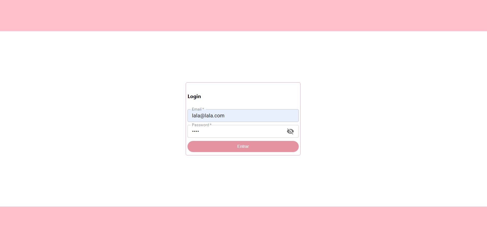
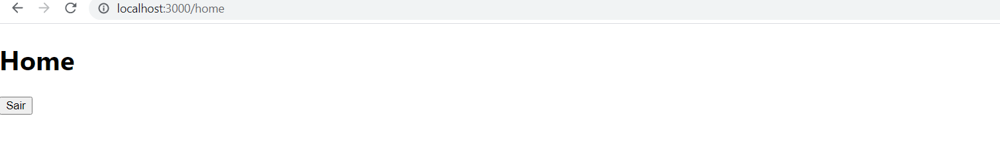
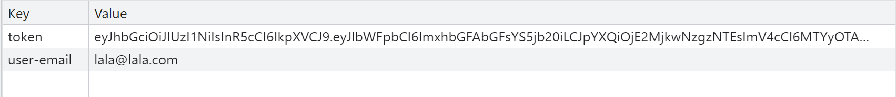

# Estudo com Autenticação JWT mockada

Esse projeto teve como objetivo analisar e estudar a aplicação da autenticação JWT mockada no front, gerando o token e salvando via localStorage.

## Ferramentas Utilizadas

- [ReactJS](https://pt-br.reactjs.org/) versão 17.0.2;
- [React Router DOM](https://www.npmjs.com/package/react-router-dom) versão 5.2.0;
- [Material UI](https://material-ui.com/pt/) versão 4.12.3;
- [Material UI Icons](https://material-ui.com/pt/) versão 4.11.2;
- [JSON Server Auth](https://www.npmjs.com/package/json-server-auth) versão 2.1.0;
- [JSON Server](https://www.npmjs.com/package/json-server) versão 0.16.3;
- [Node](https://nodejs.org/en/) versão 14.17.1;
- [NPM](https://www.npmjs.com/) versão 6.14.13;
- [Git](https://git-scm.com/) versão 2.32.0;

## Acesso ao Projeto

Para acessar o projeto, basta clonar, copiando o link do repositório e rodando no terminal:
### `git clone {+link copiado}`

E para subir a aplicação será necessário colocar no terminal:
### `npm run start`
### `npm run server`
Irá abrir a aplicação react na porta:
[http://localhost:3000](http://localhost:3000) visivel no browser.
E irá subir também o json-serve na porta 8000.

Para rodar os testes digite no terminal:
### `npm run test`
**Obs.: Nesse projeto de estudo ainda não foi aplicado testes.**

Para fazer o build, basta colocar no terminal:
### `npm run build`

## Telas

O login:

Estando ok e entrando no home:

Será registrado no localStorage o token:

E ao final, clicando em sair é tirado o token do localStorage.